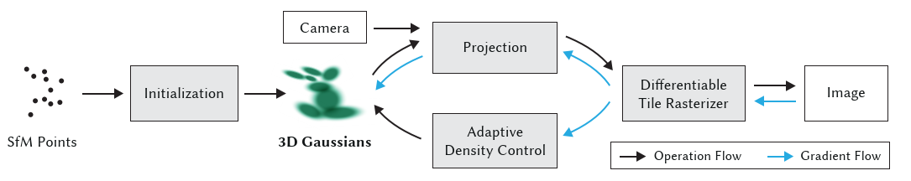
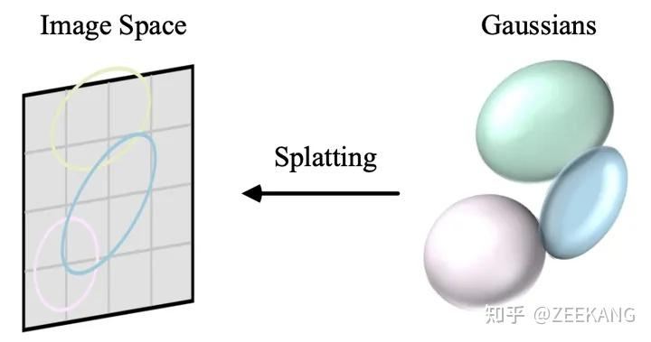
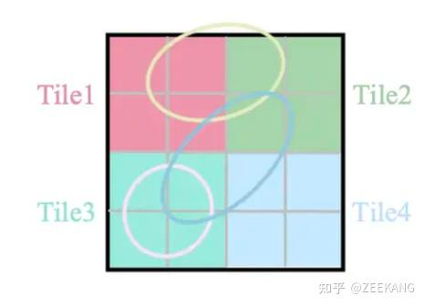
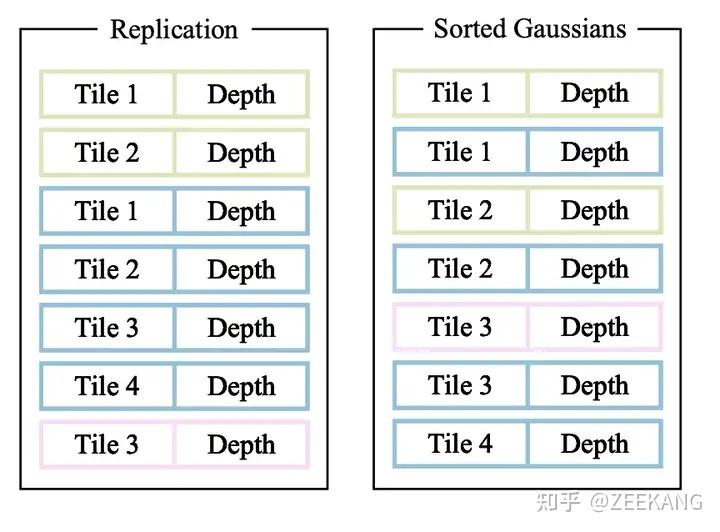
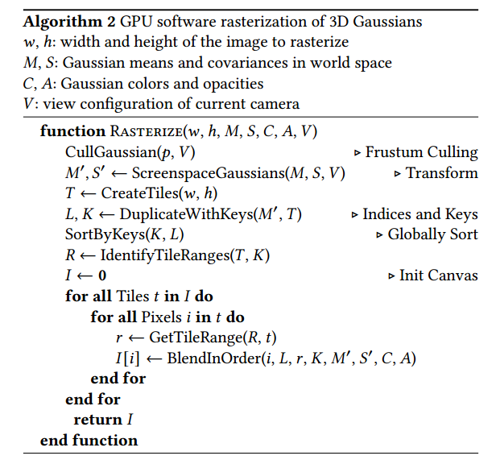
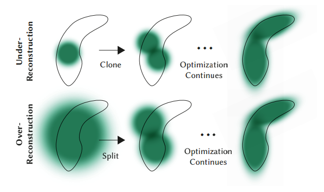
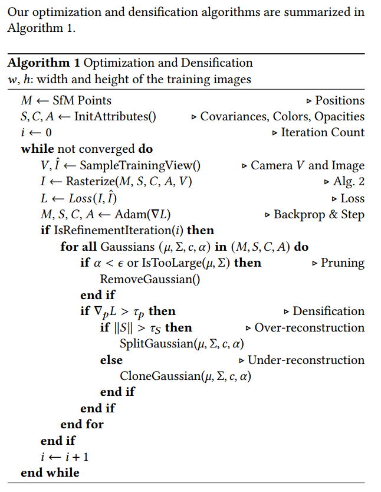

# **3D Gaussian Splatting for Real-Time Radiance Field Rendering**

基于splatting和机器学习的三维重建方法

## 整体框架

1. 通过**sfm**获得初始化稀疏点云（colmap）
2. 基于初始化点云生成**3D高斯椭球**集
3. 相机模型的投影矩阵
4. 可微分渲染
5. Loss比对迭代（点云位置，点云颜色，不透明度，高斯椭球的协方差矩阵）
6. 基于梯度自适应改变点云的分布方式

**整个3dgs的流程可以形象化地表现为3个模块：**

* 选择雪球（3D高斯椭球）
* 抛掷雪球（从3D投影到2D）
* 合成雪球（渲染成像）

##  3D Gaussian

### 3D高斯的物理意义

3D高斯具有很好的数学性质：

* 经过仿射变换后的的高斯核仍然闭合
* 3D高斯投影到2D后，依然为高斯分布

表达式：
$$
G(x)=\frac{1}{\sqrt{(2\pi)^{k}\vert \sum \vert}}e^{-\frac{1}{2}(x-\mu)^{T}\sum^{-1}(x-\mu)}
$$
其中$\sum$表示协方差矩阵，半正定，$\vert \sum \vert$为该矩阵的行列式

3D高斯函数的中心点由均值向量**$\mu$**决定，椭球体的三个主轴对应高斯分布的协方差矩阵$\sum$的特征向量，而特征值的大小则决定对应特征向量方向上的扩散程度**，特征值的平方根对应着主轴的长度。**

### 协方差矩阵的优化

**协方差矩阵只有在半正定时才有物理意义**，但是传统的梯度下降算法很难对矩阵施加此类约束，故不可以将协方差矩阵作为一个优化参数直接优化。

由协方差矩阵的几何意义可知，其表示该椭圆球在空间中的形状（缩放）和方向（旋转）。可通过特征值分解的方式将协方差矩阵进行分解
$$
\sum=Q\Lambda Q^{T}
$$

* 协方差矩阵$\sum$是一个3$\times$3的矩阵
* $Q$是由特征向量组成的正交矩阵（旋转矩阵）
* $\Lambda$是对角矩阵，其对角线上是协方差矩阵的三个特征值$\lambda_{1}$、$\lambda_{2}$、$\lambda_{3}$

由前文中所提到的主轴的长度对应着特征值的平方根，可对$\Lambda$进行进一步分解，就可得到原论文中的形式：
$$
\sum=RSS^{T}R^{T}
$$

* $S$是一个对角缩放矩阵，其对角线上是协方差矩阵的三个特征值的平方根$\sqrt{\lambda_{1}}$、$\sqrt{\lambda_{2}}、\sqrt{\lambda_{3}}$
* $R$是一个用四元数表示的旋转矩阵

通过优化旋转矩阵和缩放矩阵，可以保持协方差矩阵的半正定。

**而通过定义$R,S$以及均值$\mu$ 可得到三维空间中的所有三维高斯椭球**

## Splatting

3D高斯椭球是三维空间中的物体，若要生成图像，则需要将其投影到2D平面上

该过程包括**camera transformation**和**projection transformation**

由于projection transformation存在**非线性变换**的问题（具体见E:\note\Computer-Graphics\Transformation.md），再论文中使用**Jocobin Matrix**来近似

则协方差变换过程为:
$$
\sum'=JW\sum W^{T}J^{T}
$$
其中$W$为$M_{cam}$,$J$为雅可比矩阵。

## Fast Differentiable Rasterizer

为了加速渲染，3DGS选择了Tile-based rasterization,将image切成了16*16的tile,每个tile独立计算颜色值，最后多个tile拼成image的颜色。

考虑到每个3DGS投影过程中可能会投影到多个tile，处理方法为如果一个高斯椭圆与多个tile相交，就实例化多次Gaussian,每个Gaussian instance 都会得到一个结合 view space depth和tile ID得到的key。基于这些key,使用single fast GPU Radix sort进行排序，最后对每个tile分别进行 **Alpha Blending**,计算像素颜色值得到图像。

快速光栅化的算法流程如下所示：

**point-based rending**过程类似于Nerf,通过混合重叠在像素上的N个有序高斯椭球来计算像素的颜色
$$
C=\sum_{i\in N}c_{i}\alpha_{i}\prod_{j=1}^{i-1}(1-\alpha_{j})
$$
$C$代表每个点的输出颜色,表示在该像素位置上，所有高斯椭球的颜色经过透明度混合后的结果。

$\alpha_{i}$表示第i个高斯椭球的透明度。

$\prod_{j=1}^{i-1}(1-\alpha_{j})$表示光线从前$i-1$个高斯椭球穿透的程度。

## Initialization

使用SFM算法来从输入图像中得到一组点云，算法的基本思路是利用多张包含相同场景不同部分的图像，通过追踪图像中的共同特征，估计出相机的运动路径（即相机的外参，包括位置和平移）以及场景的三维点云结构。3DGS利用从SFM算法中得到的初始点云进行初始化，即将每个点云转换为3D高斯椭球。

## Adaptive Densification

使用SFM算法初始化一系列稀疏点之后，Adaptive Densification方法可以动态调整3D Gaussians的数量和密度。

每100次迭代会判断点云的分布是否合理，

1.移除透明度低于$\epsilon_{\alpha}$或离相机过近的高斯椭球(pruning)

2.基于梯度判断重构情况(densification)

对于重建不足的情况，对高斯椭球进行克隆（方差很小）

对于过度重建的情况，对高斯椭球进行分割（方差很大）

****

## Optimization

通过对比同一视角下，模型生成的图片与实际的训练集图片来计算损失函数
$$
\mathcal {L}=(1-\lambda)\mathcal {L}_{1}+\lambda\mathcal {L}_{D-SSIM}
$$

原论文中$\lambda=0.2$

使用**随机梯度下降法**迭代 **Mean、Covariance Matrix、$\alpha$、color**

下图为算法的整体流程

