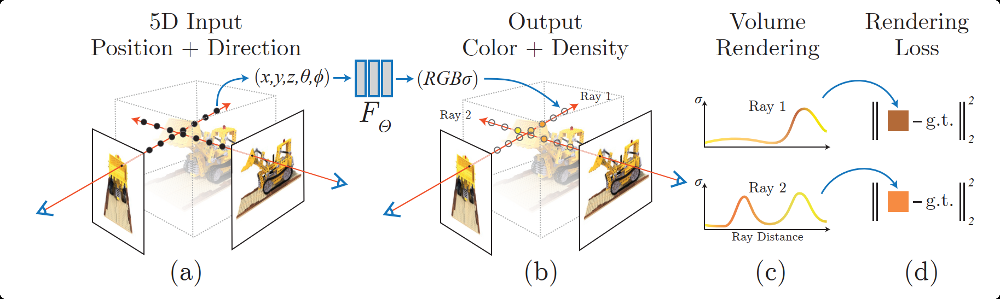
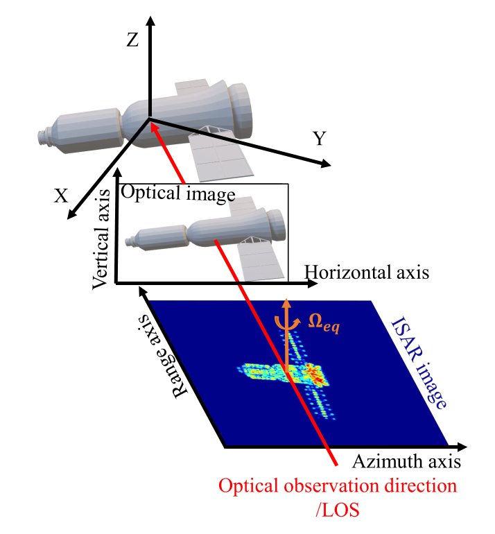
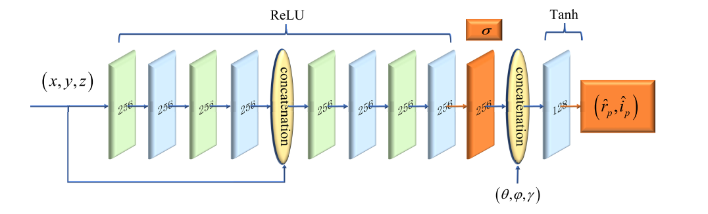
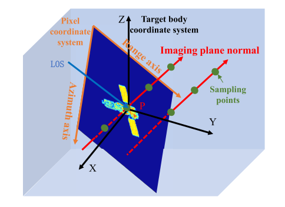
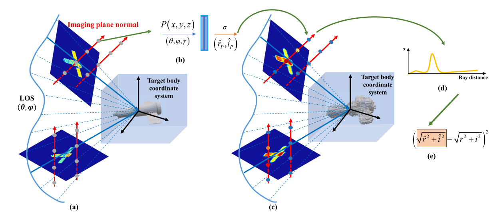
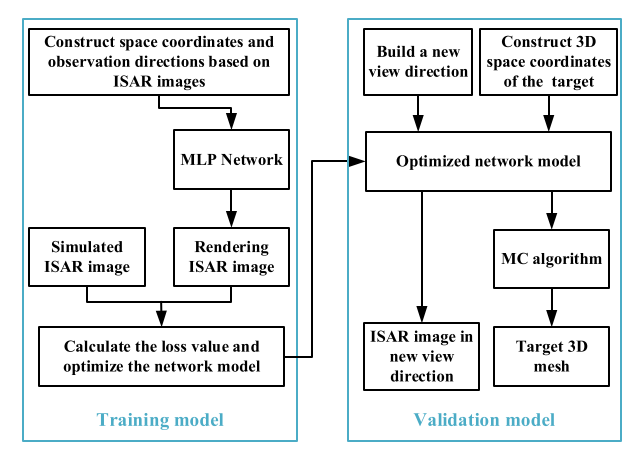

# RaNeRF

​        从上研究生到现在快半年的时间，现在重新拿起来这篇毕设时复现过的论文研究一下，为后面的研究工作打好基础。

​        传统的NeRF算法只应用于光学图像，是一种对3D场景的隐式表征，其将复杂的三维场景表达信息存储在函数的参数中，并且由于"隐式表示"函数是一种连续化的表达，其对于场景的表达会更加精细。

​      这篇论文主要是在NeRF基础上针对ISAR成像的需求和特点，进行针对化的改进，从而实现ISAR像序列的三维重构。

## 光学成像与雷达成像关系

​       ISAR像和光学图像本质上的区别主要还是成像方式上的不同，所以想把光学领域中的三维重构算法应用于ISAR成像中，首先要解决的问题的就是成像方式上的差异。

​        从图上可以清晰地看到，对于光学成像而言，相机的观测方向与成像平面的法向量是平行的关系，而雷达视线方向（LOS）与成像平面法向量是垂直的关系，通过具体的公式推导可以发现ISAR成像和光学成像都可以用统一的投影关系来表示。这可以当作将神经辐射场应用于ISAR领域的前提。

## RaNeRF网络模型构建

  RaNeRF与NeRF网络结构基本相似,不同点在于

* **输入不同**：在NeRF网络中输入分别为点的坐标$(x,y,z)$,相机的视线方向$(\theta,\phi)$，而在RaNeRF中考虑到雷达成像的机理，在雷达视线（LOS）的基础上加入了成像平面法线方向（$\theta$，$\phi$，$\gamma$）
* **输出不同：**使用复散射系数代替RGB
* **激活函数不同**：考虑到复散射系数有正有负，最后输出层的激活函数使用的是Tanh函数

## RaNeRF网络输入构建

该部分核心思想与原NeRF相同，沿成像平面法向量方向进行采样点的采样，需要注意的是从二维坐标系到三维坐标系的转换关系。

## RaNeRF的渲染过程

$$
\hat{C}(\pmb{r_{n}})=\sum_{i=1}^{N}T_{i}(1-exp(-\sigma_{i}\delta_{i}))\pmb{c}_{i}
$$

$$
T_{i}=exp(-\sum_{j=1}^{i-1}\sigma_{j}\delta_{j})
$$

位置编码和分层采样思想同样被应用到RaNeRF中

RaNeRF算法全流程

# 仿真验证

1. 使用MATLAB对散射点模型进行仿真成像，并使用本算法对简单散射点模型，卫星一号模型，卫星二号模型的ISAR像序列进行三维重构，使用RMSE指标衡量本算法与传统算法的效果。

2. 同时比较了不同信噪比下的算法的重构效果。
3. 指出了了在ISAR像有遮挡情况下，三维重构的结果还存在一定的问题。

